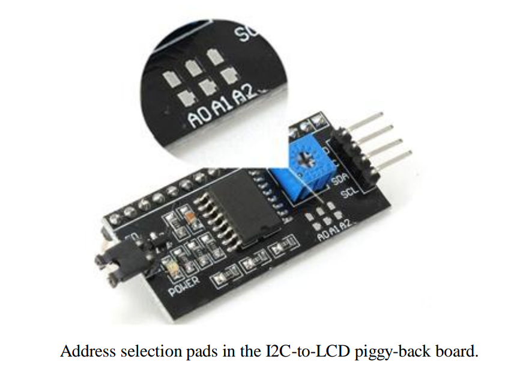
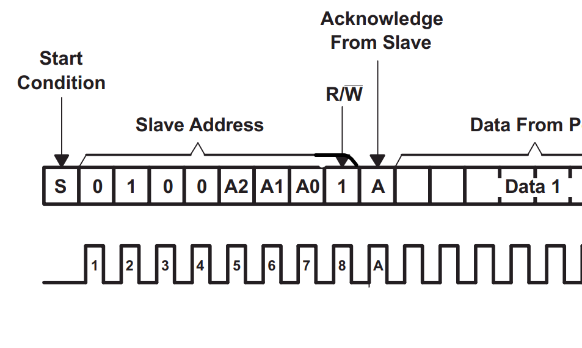
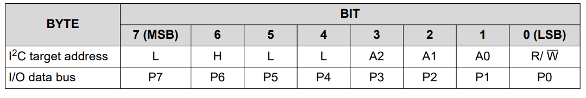
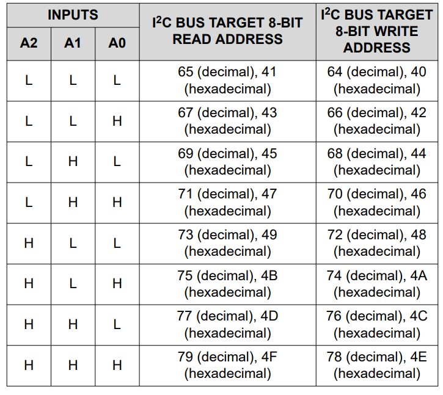
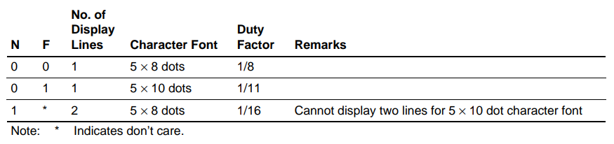
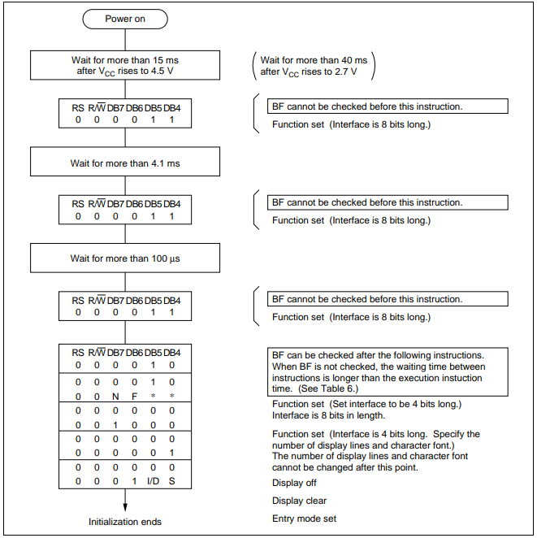

# I2C LCD Library for STM32

This is a full-featured* I2C LCD library for STM32 microcontrollers. The library is object-oriented, allowing you to manage multiple LCDs simultaneously by creating instances for each display.

> Support for reading data and current AC address is not yet implemented.

# Usage example

### basic example

```c
i2cLcd_handle i2c_lcdh = {
  .hi2c = &hi2c1,       // Pointer to your I2C handler
  .A0A1A2 = 0b111,      // Inputs (A0 A1 A2) for the I2C address of the LCD (refer to figure 1.0)
  .cursor = true,       // Show cursor
  .cursorBlink = true,  // Enable blinking cursor
  .functionSet_N = 1,   // Sets the number of display lines (0 for 1 line, 1 for 2 lines)
  .functionSet_F = 0,   // Font see table 1 below
  .entryMode_ID = 1,    // Increments (I/D = 1) or decrements (I/D = 0) the cursor address by 1 when a character code is written into or read.
  .entryMode_S = 0      // Shifts the entire display When cursor shifts if set to 1
};

lcdInit(&i2c_lcdh);

lcd_puts(&i2c_lcdh, "Hello World!");
```

### All functions example


```c
i2cLcd_handle i2c_lcdh = {
  .hi2c = &hi2c1,       // Pointer to your I2C handler
  .A0A1A2 = 0b111,      // Inputs (A0 A1 A2) for the I2C address of the LCD (refer to figure 1.0)
  .cursor = true,       // Show cursor
  .cursorBlink = true,  // Enable blinking cursor
  .functionSet_N = 1,   // Sets the number of display lines (0 for 1 line, 1 for 2 lines)
  .functionSet_F = 0,   // Font see table 1 below
  .entryMode_ID = 1,    // Increments (I/D = 1) or decrements (I/D = 0) the cursor address by 1 when a character code is written into or read.
  .entryMode_S = 0      // Shifts the entire display When cursor shifts if set to 1
};

lcdInit(&i2c_lcdh);

lcd_putchar(&i2c_lcdh, 'h');
HAL_Delay(200);
lcd_putchar(&i2c_lcdh, 'h');
HAL_Delay(200);
lcd_putchar(&i2c_lcdh, '7');
HAL_Delay(200);
lcd_clearDisplay(&i2c_lcdh);
HAL_Delay(200);
lcd_putchar(&i2c_lcdh, '5');
HAL_Delay(200);
lcd_putchar(&i2c_lcdh, 'h');
HAL_Delay(200);
lcd_putchar(&i2c_lcdh, ' ');
HAL_Delay(200);
lcd_puts(&i2c_lcdh, "Hello?");
HAL_Delay(200);
lcd_shiftCusorOrDisplay(&i2c_lcdh, LCD__SHIFT_LEFT, false);
HAL_Delay(200);
lcd_putchar(&i2c_lcdh, '!');
HAL_Delay(200);
lcd_shiftCusorOrDisplay(&i2c_lcdh, LCD__SHIFT_LEFT, true);
HAL_Delay(200);
lcd_shiftCusorOrDisplay(&i2c_lcdh, LCD__SHIFT_LEFT, true);
HAL_Delay(200);
lcd_shiftCusorOrDisplay(&i2c_lcdh, LCD__SHIFT_LEFT, true);
HAL_Delay(200);
lcd_shiftCusorOrDisplay(&i2c_lcdh, LCD__SHIFT_RIGHT, true);
HAL_Delay(200);
lcd_shiftCusorOrDisplay(&i2c_lcdh, LCD__SHIFT_RIGHT, true);
HAL_Delay(200);
lcd_shiftCusorOrDisplay(&i2c_lcdh, LCD__SHIFT_RIGHT, true);
HAL_Delay(200);
lcd_moveCursorHome(&i2c_lcdh);
HAL_Delay(200);
lcd_putchar(&i2c_lcdh, 'o');
HAL_Delay(200);
lcd_moveCursor(&i2c_lcdh, 1, 3);
lcd_puts(&i2c_lcdh, "By Brachi");
HAL_Delay(200);
lcd_displayOff(&i2c_lcdh);
HAL_Delay(200);
lcd_displayOn(&i2c_lcdh);
HAL_Delay(1000);
lcd_displayOff(&i2c_lcdh);
HAL_Delay(200);
lcd_displayOn(&i2c_lcdh);
HAL_Delay(1500);

i2c_lcdh.entryMode_ID = 0;
i2c_lcdh.entryMode_S = 1;
lcd_updateEntryMode(&i2c_lcdh);
lcd_clearDisplay(&i2c_lcdh);
lcd_moveCursor(&i2c_lcdh, 0, 6);
lcd_putchar(&i2c_lcdh, 'W');
HAL_Delay(200);
lcd_putchar(&i2c_lcdh, 'e');
HAL_Delay(200);
lcd_putchar(&i2c_lcdh, 'i');
HAL_Delay(200);
lcd_putchar(&i2c_lcdh, 'r');
HAL_Delay(200);
lcd_putchar(&i2c_lcdh, 'd');
HAL_Delay(200);
lcd_putchar(&i2c_lcdh, '!');
HAL_Delay(200);
lcd_puts(&i2c_lcdh, "hmm?");
HAL_Delay(200);

i2c_lcdh.cursor = false;
i2c_lcdh.cursorBlink = false;
lcd_updateCursorOprions(&i2c_lcdh);
HAL_Delay(1500);


i2c_lcdh.entryMode_ID = 1;
i2c_lcdh.entryMode_S = 0;
i2c_lcdh.cursor = true;
i2c_lcdh.cursorBlink = true;
lcd_updateEntryMode(&i2c_lcdh);
lcd_updateCursorOprions(&i2c_lcdh);
lcd_moveCursorHome(&i2c_lcdh);
```

Here is a simple API reference section you can add to your readme.md:

---

# API Reference

| Function | Description |
|----------|-------------|
| `bool lcdInit(const i2cLcd_handle *lcd);` | Initializes the LCD. Returns true if successful. |
| `bool lcd_sendCmd(const i2cLcd_handle *lcd, const char cmd);` | Sends a command byte to the LCD. |
| `bool lcd_clearDisplay(const i2cLcd_handle *lcd);` | Clears the display. |
| `bool lcd_displayOn(const i2cLcd_handle *lcd);` | Turns the display on. |
| `bool lcd_displayOff(const i2cLcd_handle *lcd);` | Turns the display off. |
| `bool lcd_updateCursorOprions(const i2cLcd_handle *lcd);` | Updates cursor visibility and blink options. |
| `bool lcd_updateEntryMode(const i2cLcd_handle *lcd);` | Updates entry mode (increment/decrement, shift). |
| `bool lcd_shiftCusorOrDisplay(const i2cLcd_handle *lcd, const LCD__SHIFT shift, const bool shift_display);` | Shifts cursor or display left/right. |
| `bool lcd_moveCursor(const i2cLcd_handle *lcd, int row, int col);` | Moves cursor to specified row and column. |
| `bool lcd_moveCursorHome(const i2cLcd_handle *lcd);` | Moves cursor to home position (0,0). |
| `bool lcd_sendData(const i2cLcd_handle *lcd, const char data);` | Sends a data byte (character) to the LCD. |
| `bool lcd_putchar(const i2cLcd_handle *lcd, const char ch);` | Sends a single character to the LCD. |
| `bool lcd_puts(const i2cLcd_handle *lcd, const char *str);` | Sends a string to the LCD. |

---

# Refrences

### Table 1
The address connections (A0-A1-A2) are not bridged with solder it will have the slave address 0x40 (A0=1,A1=1,A2=1).








### Figure 1

Font:



### Figure 2


### Function Set

DL: Sets the interface data length. Data is sent or received in 8-bit lengths (DB7 to DB0) when DL is 1,and in 4-bit lengths (DB7 to DB4) when DL is 0.When 4-bit length is selected, data must be sent orreceived twice.

N: Sets the number of display lines.

F: Sets the character font.

Note: Perform the function at the head of the program before executing any instructions (except for the read busy flag and address instruction). From this point, the function set instruction cannot be executed unless the interface data length is changed.

### Entry Mode Set
I/D: Increments (I/D = 1) or decrements (I/D = 0) the DDRAM address by 1 when a character code is written into or read from DDRAM.

The cursor or blinking moves to the right when incremented by 1 and to the left when decremented by 1.

The same applies to writing and reading of CGRAM.

S: Shifts the entire display either to the right (I/D = 0) or to the left (I/D = 1) when S is 1. The display does
not shift if S is 0.

If S is 1, it will seem as if the cursor does not move but the display does. The display does not shift when reading from DDRAM. Also, writing into or reading out from CGRAM does not shift the display.
